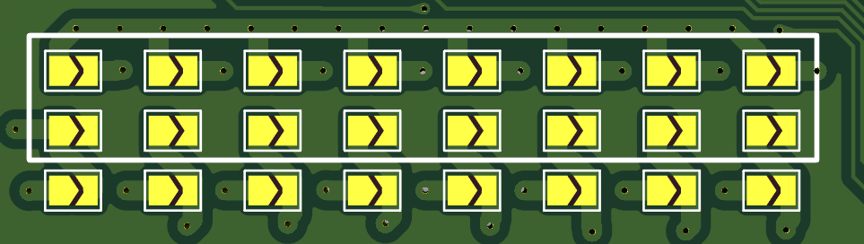

# NJIT Solar Car | CAN-IO Board Hardware/Firmware Development

- [Main Github][01]
- [Docs for code][02]

## Fabrication notes

- Board is 4 layer, 100mm\*100mm
- It should be set to 1.6mm, using the FR4 TG135 (default) core, and JLC04161H-7628 stackup from JLCPCB.
- Outer copper weight should be *1oz* and inner copper weight *0.5oz* (not the 2oz and 1oz which the design centered around earlier). This allows a maximum **2A current draw** from each output channel.
- If possible, order the stencil as well
- Use DHL or FedEx shipping, the Global standard direct line is cheap but takes upwards of 2 weeks for shipping alone.
- Rough total, including stencil, board, shipping, and tariffs should be **~$50-70**.

## Mechanical Notes

- Dimensions are 100mm\*100mm, with 3mm fillet on corners.
- The two bottom PTHs are 4.25mm away from the bottom and side edges, and the top PTHs are 25mm away from the top.
- WAGO Connectors are spaced 3.371mm from each other and are spaced evenly about the center of the board, 2.68mm away from the top edge.
- When on, 12V is supplied to the LEFT side of the WAGO connector when facing it. 12V at the port above the small silkscreen arrow.
- Relays are Panasonic SPST-NO relays with no internal flyback diode. Coil voltage and current consumption is 12V 30mA, so 360mW per relay.
- High current output passes through solder bridges, 1mm traces (1oz outer copper, 2.4A current capacity), relays (5A), and WAGO 2601 connector. The weak link is the solder bridge which can handle 2A per channel.
- The input power screw terminal is capable of 15A continuous. High current pins have either 1mm traces to/from or 2 spokes of 0.5mm thermal relief.

## Assembly Notes

- There are two CAN connectors, but only one has to be soldered (either the screw terminal, or the 3 pin DTF).
- The radial capacitors are electrolytic and thus *must* be installed with the correct polarity.
- The columns of solder bridges (shown below) correspond to the 8 relays and outputs. If, for a given output channel (column of SBs), the *top two* are bridged via a thick dollop of solder, the on-state of the relay will present 12V at one end of the connector and ground at the other. **On the other hand**, if *only the bottom* SB is bridged with solder, the on-state of the relay will simply connect the 2 terminals of the WAGO connector internally. This is handy if you want to drive something with a separate power source, or with a different voltage.

<!-- Links -->
[01]: https://github.com/NJIT-Solar-Car/canio
[02]: https://njit-solar-car.github.io/canio/html
